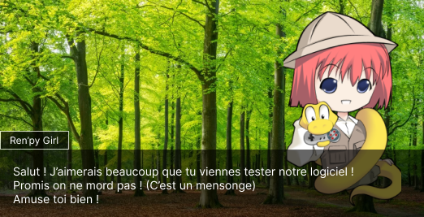

# Œstro-gen

## Projet

Création d'un "logiciel" alimenté par IA génératrices permettant de créer des jeux "Visual Novel".

Le logiciel fonctionne grâce à [EMF : Easy Model Fusion](https://github.com/easy-model-fusion)

Il permet d'installer en local plusieurs IA génératrices (image, texte, musique).

Totalement offline, le logiciel va construire un jeu et l'exporter au format Ren'py.

Il inclut :  
- un studio de création de personnages
- un studio de création d'histoires avec des dialogues

 
